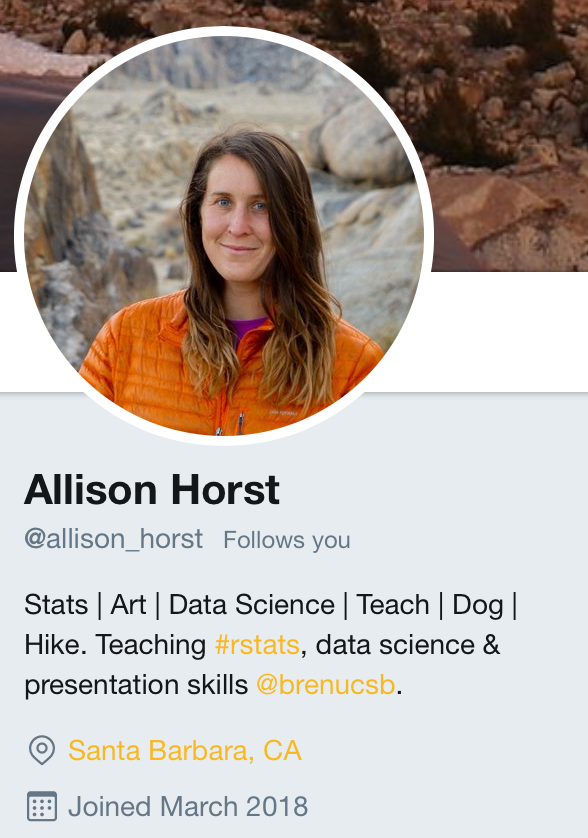

```{r setup, include=FALSE}

# ffmpeg -i esquisse.mov -pix_fmt yuv422p -r 10 -s 720x540 esquisse.gif

knitr::opts_chunk$set(echo = FALSE)

#devtools::install_github("rstudio/gt")
library(gt)
library(tidyverse)
library(knitr)
library(reticulate)
library(ggthemes)
library(kableExtra)
mtcars %>%
  rownames_to_column( var = 'longname') ->
df_cars
```

## Disclaimer

```
* I am sharing my personal views not the views of RenaissanceRe 
  or any of its subsidiary companies.
  
* Thought provoking only: The materials are provided for information 
  purposes only and are in summary form.
  
* This is not consulting: No representations or warranties are given. 
  If you want to use these ideas, hire a pro.
  
* This is not financial advice: No financial advice is being given 
  nor any recommendation to invest in any product. 
  
* Historical data is no assurance as to future results.
```


## Source

All data, code, and examples: 

[CerebralMastication/Presentations](https://github.com/CerebralMastication/Presentations/)

```{r, out.width = "85%"}
knitr::include_graphics("./fig/github.png")
```

Take Pix, Dance, Ask, Tweet  **@cmastication**

http://CerebralMastication.com/

## QR Code Example


## Quick Survey


## Most Common Programming Language in Both Business and Government: {.medium-body .build}

* Reactive

* Functional

* REPL Environment

* Tabular Data DSL

## {data-background=./fig/excel.png }

## Build Bridges {data-background=./fig/dare_bridge.png}


## @cmastication

<div align="center">

</div>

## {data-background=./fig/rcookbook2e.png}

## {data-background=./fig/brands.png}

## {data-background=./fig/rnr.jpg data-background-size=cover}

## {data-background=./fig/wallst.jpg data-background-size=cover}

## {data-background=./fig/richmond.jpg data-background-size=cover}

## Spreadsheet Challenges {.medium-body .build}

* Commingle Data, Business Logic, and Presentation 

* Changing Data is Easy & Tracking Changes is Hard 

* Versioning: `Q-End_2018-Q4_final4_revised.xlsx`

* Speed and Size

* Reads Non-linearly

## Data Science Workflow {data-background=./fig/data-science-explore.png}

## JD's Lemma: {.medium-body}

To migrate Excel analysts to coding, help them be better at Excel first. 

If you fail to migrate them to coding, you will at least have better Excel!


## Corporations Are Sad Silos {data-background=./fig/Sad_Cubicles_2.png}


## {data-background=./fig/Office-R-github.png}

<sup>Art by Allison Horst</sup>


## {data-background=./fig/tribalism.jpg data-background-size=cover}

## {data-background=./fig/circus_tent_blueprint.png data-background-size=cover}

## How do Business Analysts See Themselves... 

## {data-background=./fig/avengers_strut.gif }

## {data-background=./fig/fire_deadlift.gif }

## {data-background=./fig/cantdoit.jpg data-background-size=cover}

## Tools AND Training Get Analysts Over the Line
```{r, out.width = '85%'}
n <- 1000
df <- data.frame(curve = 'Learn Fast',
                 x = rt(n, 100))
df <- rbind(df, data.frame(curve = 'Struggle Long',
                           x = rnorm(n, 3, 2)))


ggplot(df, aes(x, color = curve)) +
  stat_ecdf(geom = "step", size = 2) +
  theme_classic(base_size = 18) +
  scale_colour_wsj("colors6") +
  theme(
    axis.text.x = element_blank(),
    axis.ticks.x = element_blank(),
    axis.text.y = element_blank(),
    axis.ticks.y = element_blank()
  ) +
  theme(legend.position = c(0.75, 0.15)) +
  theme(legend.title = element_blank()) +
  labs(x = "Time", y = "Skill") +
  geom_hline(yintercept = .25,
             color = "orangered",
             linetype = 2) +
  annotate(
    "text",
    x = -2.2,
    y = .29,
    label = "Suck Threshold",
    size = 5
  ) +
  geom_hline(yintercept = .75,
             color = "forestgreen",
             linetype = 2) +
  annotate(
    "text",
    x = -1.9 ,
    y = .79,
    label = "Kick Ass Threshold",
    size = 5
  )

```

  
## JD's Lemma: {.medium-body}


To migrate Excel analysts to coding, help them be better at Excel first. 

If you fail to migrate them to coding, you will at least have better Excel!


## Build a Culture of Good Excel Hygiene {.medium-body}

* Not Stylistic - Let Marketing Own That

* Principle Based:

    * Minimize Errors
    
    * Maximize Readability
    
    * Save Time

## {data-background=./fig/iris_excel.png}

## {data-background=./fig/iris_excel_formula.png}

## {data-background=./fig/iris_excel_pivot.png}

## But that Coding Environment Though...

<!-- Shout out to [jupyter-rsession-proxy](https://github.com/jupyterhub/jupyter-rsession-proxy) -->


## {data-background=./fig/jupyterlab.gif data-background-size=cover}

## Friction! {.medium-body}

Energy converted to heat:

$$E_{th}=\int _{C}\mathbf {F} _{\mathrm {fric} }(\mathbf {x} )\cdot d\mathbf {x} \ =\int _{C}\mu _{\mathrm {k} }\ \mathbf {F} _{\mathrm {n} }(\mathbf {x} )\cdot d\mathbf {x} $$

<font size="2"> Source: https://en.wikipedia.org/wiki/Friction </font> 


## {data-background=./fig/vicegrips.jpg }

## {data-background=./fig/vicegrip_AC.jpeg data-background-size=cover}

## {data-background=./fig/vicegrip_dryer.jpeg data-background-size=cover}

## {data-background=./fig/vette.jpg data-background-size=cover}


## How To Coexist? {.bigcode}

Example Design Pattern:

```{r, eval=FALSE, echo=TRUE}
library(tidyverse)
library(openxlsx)
wb <- loadWorkbook("iris_wb.xlsx")
```

## Write & Save {.bigcode}

```{r, eval=FALSE, echo=TRUE}
writeDataTable(
  wb = wb,
  sheet = "iris_sheet",
  x = iris,
  startCol = 1,
  startRow = 1,
  tableStyle = "TableStyleLight9",
  tableName = "iris_table")
saveWorkbook(wb = wb,
             file = "iris_wb.xlsx",
             overwrite = T)
```

## {data-background=./fig/is_it_worth_the_time.png}

## {data-background=./fig/all-wrong.jpg}

## XKCD Assumptions: {.medium-body}

***Assumption:*** 

All time is of equal value


***Reality:*** 

Certain windows of time are precious

## XKCD Assumptions: {.medium-body}

***Assumption:*** 

Current frequency of reporting = future freq


***Reality:*** 

Once automated, reports find new uses

## XKCD Assumptions: {.medium-body}

***Assumption:*** 

All time spent doing analytics is of equal utility 


***Reality:*** 

Some tasks are so awful you just can't even...


## XKCD Assumptions: {.medium-body}

***Assumption:*** 

Automated and manual workflows produce the same product


***Reality:*** 

Manual processes breed errors
 
## {data-background=./fig/10per.png}

## {data-background=./fig/Office-R-github.png}


## Why R & Python? {.big-body}

***Python*** - Existing Code, IT adoption

***R*** - Powerful, Approachable, Workflow from Database to Output

## Example R Table Output {.small-body}
```{r, echo=TRUE, results='asis'}
df_cars  %>%
  filter(hp > 90) %>%
  group_by(cyl) %>%
  summarize(avg_hp = mean(hp)) %>%
  gt() %>%
  fmt_number(columns = vars(avg_hp), decimals = 1) %>%
  tab_header(title = "What a Pretty Table!")
```

## Example R Plotting

```{r, echo=TRUE}
ggplot(df_cars, mapping = aes(x = as.factor(cyl), y = hp)) +
  geom_boxplot()
```

## Example R Plotting 

```{r, echo=TRUE}
ggplot(df_cars, mapping = aes(x = disp, y = hp)) +
  geom_point()
```


## Render Same Source Different Output 


## Render Same Source Different Output {data-background=./fig/alltypes.png}

<!--  -->

## Different Languages in R Markdown
````markdown
`r ''````{python}
x = 'hello, python world!'
x.split(' ')
```
````
```{python}
x = 'hello, python world!'
x.split(' ')
```
````markdown
`r ''````{r}
py$x
```
````
```{r}
py$x
```

## Different Languages in R Markdown
````markdown
`r ''````{r}
py$x <- 'Updated in R'
```
````
```{r}
py$x <- 'Updated in R'
```
````markdown
`r ''````{python}
x.split(' ')
```
````
```{python}
x.split(' ')
```


## What's the Point? {.medium-body}

* Excel is Your Most Used Programming Language

* Lower the Friction to Helping Business Users Adopt Additional Tools

* Don't Boil the Ocean: 10% Improvement

* Business, Automate Yourself 


## Art by Allison Horst: `@allison_horst`

<div align="center">

</div>
All drawn digitally with Procreate on iPad...


