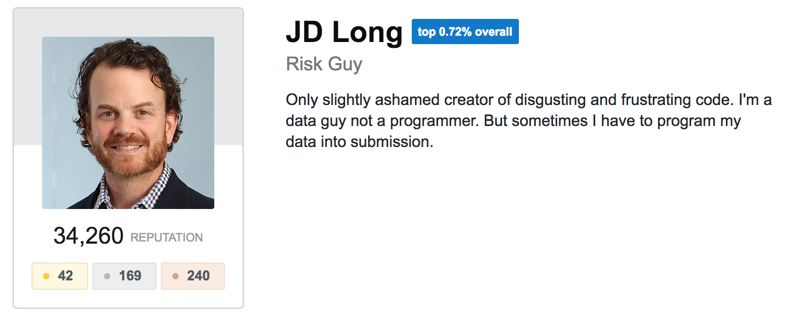
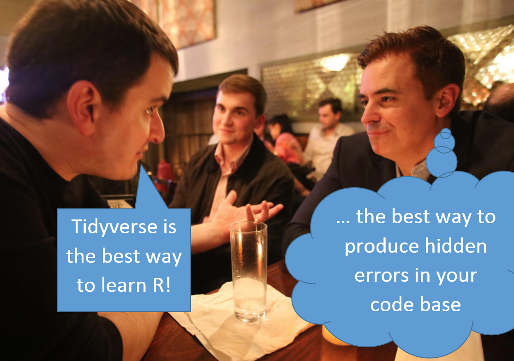

Down with OPP (Other People's Pipes)
========================================================
author: JD Long
date:   May 9, 2018
font-family: 'Helvetica'
#incremental: true
css: custom.css

Where are we going?
========================================================

- `dplyr` can be fast to write
- `dplyr` can write SQL 
- `dplyr` writing SQL is fast
- One controversial idea
- One warning
- One hack (row-wise)

Where can I find this prez? 
======================

Hosted Slideshow: 
http://bit.ly/opp_dplyr

Source code on Github: 
http://bit.ly/opp_source

JD Who?
========================================================
<div align="center">

<br>

</div>

OPP?
======================
<div align="center">

<br>
Tidy by Nature

R puns rock!
===================
```
sink("/dev/null")
```

The Unsinkable /dev/null
===================

<div align="center">

<br>

RenaissanceRe
==========================
<div align="center">

<br>

We're Hiring!
========================================================


NYC Risk Analyst 
- early/mid career 
- Not R centric   `    :(`
- Team with me  `  :)`

http://bit.ly/rnr_job

dplyr - set up example
========================================================


```r
library(tidyverse)

mtcars %>%
  rownames_to_column( var = 'longname') ->
df_cars
```
dplyr - select
========================================================


```r
df_cars %>% 
  select(longname, cyl, hp) %>%
  head
```

```
           longname cyl  hp
1         Mazda RX4   6 110
2     Mazda RX4 Wag   6 110
3        Datsun 710   4  93
4    Hornet 4 Drive   6 110
5 Hornet Sportabout   8 175
6           Valiant   6 105
```

dplyr - filter
========================================================


```r
df_cars %>% 
  select(longname, cyl, hp) %>%
  filter( cyl == 8) %>%
  head
```

```
            longname cyl  hp
1  Hornet Sportabout   8 175
2         Duster 360   8 245
3         Merc 450SE   8 180
4         Merc 450SL   8 180
5        Merc 450SLC   8 180
6 Cadillac Fleetwood   8 205
```

dplyr - mutate
========================================================


```r
df_cars %>% 
  select(longname, cyl, hp) %>%
  filter( cyl == 8) %>%
  mutate( sqrt_hp = sqrt(hp), 
          shortname = word(longname, 1) ) %>%
  head
```

```
            longname cyl  hp  sqrt_hp shortname
1  Hornet Sportabout   8 175 13.22876    Hornet
2         Duster 360   8 245 15.65248    Duster
3         Merc 450SE   8 180 13.41641      Merc
4         Merc 450SL   8 180 13.41641      Merc
5        Merc 450SLC   8 180 13.41641      Merc
6 Cadillac Fleetwood   8 205 14.31782  Cadillac
```


dplyr - group_by
========================================================


```r
df_cars %>% 
  select(longname, cyl, hp) %>%
  filter( cyl == 8) %>%
  mutate( sqrt_hp = sqrt(hp), 
          shortname = word(longname, 1) ) %>%
  select( - longname) %>%
  group_by(shortname) %>%
  head
```

```
# A tibble: 6 x 4
# Groups:   shortname [4]
    cyl    hp sqrt_hp shortname
  <dbl> <dbl>   <dbl> <chr>    
1    8.  175.    13.2 Hornet   
2    8.  245.    15.7 Duster   
3    8.  180.    13.4 Merc     
4    8.  180.    13.4 Merc     
5    8.  180.    13.4 Merc     
6    8.  205.    14.3 Cadillac 
```

clean up - note changes
========================================================


```r
df_cars %>% 
  select(longname, cyl, hp) %>%
  mutate( shortname = word(longname, 1) ) %>%
  select( - longname)  ->
df_cars_limited
head( df_cars_limited )
```

```
  cyl  hp shortname
1   6 110     Mazda
2   6 110     Mazda
3   4  93    Datsun
4   6 110    Hornet
5   8 175    Hornet
6   6 105   Valiant
```

tangent: why pipe?
========================================================


```r
head(
  select(
    mutate( 
      select(df_cars, longname, cyl, hp) , 
      shortname = word(longname, 1) 
      ), 
    -longname 
    )
)
```

```
  cyl  hp shortname
1   6 110     Mazda
2   6 110     Mazda
3   4  93    Datsun
4   6 110    Hornet
5   8 175    Hornet
6   6 105   Valiant
```

tangent: why pipe? (cont)
========================================================
class: small-code

```r
df_cars_3vars <-
  select(df_cars, longname, cyl, hp)

df_cars_3vars_shortname <-
  mutate( df_cars_3vars, 
          shortname = word(df_cars_3vars$longname, 1) ) 

df_cars_3vars_shortname <-
  select( df_cars_3vars_shortname, - longname)  

head( df_cars_3vars_shortname )
```

```
  cyl  hp shortname
1   6 110     Mazda
2   6 110     Mazda
3   4  93    Datsun
4   6 110    Hornet
5   8 175    Hornet
6   6 105   Valiant
```

Before the tangent...
========================================================


```r
df_cars %>% 
  select(longname, cyl, hp) %>%
  mutate( shortname = word(longname, 1) ) %>%
  select( - longname)  ->
df_cars_limited
head( df_cars_limited )
```

```
  cyl  hp shortname
1   6 110     Mazda
2   6 110     Mazda
3   4  93    Datsun
4   6 110    Hornet
5   8 175    Hornet
6   6 105   Valiant
```


dplyr - summarize
========================================================


```r
df_cars_limited %>%
  group_by(shortname, cyl)%>% 
  summarize( avg_hp = mean(hp) )  %>%
  head(3)
```

```
# A tibble: 3 x 3
# Groups:   shortname [3]
  shortname   cyl avg_hp
  <chr>     <dbl>  <dbl>
1 AMC          8.   150.
2 Cadillac     8.   205.
3 Camaro       8.   245.
```
<font size=50%> Note the grouping change. wtf? </font>

dplyr - join
========================================================


```r
cyl_map <- data.frame(
  cyl = c(4,6,8), 
  cyl_name = c('four','six','eight'))

df_cars_limited %>% 
  left_join( cyl_map ) %>%
  head(3)
```

```
  cyl  hp shortname cyl_name
1   6 110     Mazda      six
2   6 110     Mazda      six
3   4  93    Datsun     four
```

dplyr - case_when (+ sort)
========================================================
class: small-code

```r
df_cars_limited %>% 
  mutate(Pow= case_when( hp>200 & cyl>=8 ~ 'Strong', 
                     TRUE ~ 'Weak') ) %>%
  arrange(-hp)
```

```
   cyl  hp shortname    Pow
1    8 335  Maserati Strong
2    8 264      Ford Strong
3    8 245    Duster Strong
4    8 245    Camaro Strong
5    8 230  Chrysler Strong
6    8 215   Lincoln Strong
7    8 205  Cadillac Strong
8    8 180      Merc   Weak
9    8 180      Merc   Weak
10   8 180      Merc   Weak
11   8 175    Hornet   Weak
12   8 175   Pontiac   Weak
13   6 175   Ferrari   Weak
14   8 150     Dodge   Weak
15   8 150       AMC   Weak
16   6 123      Merc   Weak
17   6 123      Merc   Weak
18   4 113     Lotus   Weak
19   6 110     Mazda   Weak
20   6 110     Mazda   Weak
21   6 110    Hornet   Weak
22   4 109     Volvo   Weak
23   6 105   Valiant   Weak
24   4  97    Toyota   Weak
25   4  95      Merc   Weak
26   4  93    Datsun   Weak
27   4  91   Porsche   Weak
28   4  66      Fiat   Weak
29   4  66      Fiat   Weak
30   4  65    Toyota   Weak
31   4  62      Merc   Weak
32   4  52     Honda   Weak
```
mutate vs. summarize
========================================================
`mutate` adds a column but keeps same # rows

`summarize` adds a column but reduces the rows down to one row per unique group based on `group_by`

database time!
========================================================


```r
con <- DBI::dbConnect(RSQLite::SQLite(), 
                      path = ":memory:")
## could use memdb_frame

copy_to(con, df_cars, "df_cars",
  temporary = FALSE)

df_cars_db <- tbl(con, "df_cars")
```
what are these things?
========================================================


```r
class(df_cars)
```

```
[1] "data.frame"
```

```r
class(as.tibble(df_cars))
```

```
[1] "tbl_df"     "tbl"        "data.frame"
```

```r
class(df_cars_db)
```

```
[1] "tbl_dbi"  "tbl_sql"  "tbl_lazy" "tbl"     
```

so this looks sane...
========================================================


```r
df_cars_db %>% 
  group_by( cyl) %>%
  summarize( avg = mean(hp),
             std = sd(hp) )  ->
mean_hp_by_cyl

head( mean_hp_by_cyl )
```

```
# Source:   lazy query [?? x 3]
# Database: sqlite 3.22.0 []
    cyl   avg   std
  <dbl> <dbl> <dbl>
1    4.  82.6  20.9
2    6. 122.   24.3
3    8. 209.   51.0
```

what's in mean_hp_by_cyl?
========================================================


```r
df_cars_db %>% 
  group_by( cyl) %>%
  summarize( avg = mean(hp),
             std = sd(hp) )  %>%
  show_query 
```
```
<SQL>
SELECT 
  `cyl`, 
  AVG(`hp`) AS `avg`, 
  STDEV(`hp`) AS `std`
FROM `df_cars`
GROUP BY `cyl`
```

automagic subqueries
========================================================
class: small-code

```r
df_cars_db %>% 
  group_by( cyl) %>%
  summarize( avg = mean(hp),
             std = sd(hp) )  %>%
  filter( avg > 100) %>%
  show_query 
```
```
<SQL>
SELECT *
FROM ( SELECT `cyl`, 
       AVG(`hp`) AS `avg`, 
       STDEV(`hp`) AS `std`
       FROM `df_cars`
       GROUP BY `cyl`
     )
WHERE (`avg` > 100.0)
```

oh yes...
========================================================
<div align="center">


</div>

lazy af... 
========================================================
<div align="center">


</div>

lazy af...
========================================================
class: small-code

```r
mean_hp_by_cyl %>%
  collect ->
local_mean_hp_by_cyl

head(local_mean_hp_by_cyl)
```

```
# A tibble: 3 x 3
    cyl   avg   std
  <dbl> <dbl> <dbl>
1    4.  82.6  20.9
2    6. 122.   24.3
3    8. 209.   51.0
```

```r
class(local_mean_hp_by_cyl)
```

```
[1] "tbl_df"     "tbl"        "data.frame"
```

R Mapped to SQL
========================================================
class: small-code
```
math operators: +, -, *, /, %%, ^

math functions: abs, acos, acosh, asin, asinh, atan, atan2, atanh, ceiling, cos, cosh, cot, coth, exp, floor, log, log10, round, sign, sin, sinh, sqrt, tan, tanh

logical comparisons: <, <=, !=, >=, >, ==, %in%

boolean operations: &, &&, |, ||, !, xor

basic aggregations: mean, sum, min, max, sd, var

string functions: tolower, toupper, trimws, nchar, substr

coerce types: as.numeric, as.integer, as.character
```

KNEAD MOAR?
========================================================

```
vignette("sql-translation")
```
<div align="center">


</div>

reprex
========================================================
<div align="center">

</div>

tbl_lazy & simulate_dbi
======================================================

```r
library(dbplyr)
data.frame(x = 1, y = 2) %>%
  tbl_lazy(src = simulate_sqlite()) ->
df_sqlite ## this is a lazy table

df_sqlite %>% 
  summarise(x = sd(x)) %>%
  show_query()
```

```
<SQL> SELECT STDEV(`x`) AS `x`
FROM `df`
```

simulate functions
======================================================
```
dbi           sqlite
postgres      mysql
odbc          impala
mssql         oracle
hive          odbc_postgresql
teradata      odbc_access
```

Common Snags (for me)
==========================

1) Search Path:
```
dbSendQuery(con, 
    build_sql("set search_path to 
    '$user', public, reports, sandbox"))
```

2) Name Clashes on `Join`

```r
## drop the duplicate field or rename
df_cars_db <- tbl(con, "df_cars") %>% select(-wt)
```

workflow with redshift
=====================
```
count(*)
349,523,453,670
```
* pre define joins
* pass around a "big table"
* set up criteria
* transform
* collect

WARNING!!!
===========================
dplyr can stomp on Core R functions:


```r
head( lag(ldeaths, 12) )
```

```
[1] 3035 2552 2704 2554 2014 1655
```

```r
head( lag(ldeaths, k=12) == 
        head( lag(ldeaths, 12) ) )
```

```
[1] TRUE TRUE TRUE TRUE TRUE TRUE
```

WARNING!!!
============================
Now load `dplyr`

```r
library(dplyr)
head( lag(ldeaths, 12) )
```

```
Error: `x` must be a vector, not a ts object, do you want `stats::lag()`?
```

```r
head( lag(ldeaths, k=12) )
```

```
Error: `x` must be a vector, not a ts object, do you want `stats::lag()`?
```
WARNING!!!
============================
must clarify in your code:

```r
library(dplyr)
head( stats::lag(ldeaths, 12) )
```

```
[1] 3035 2552 2704 2554 2014 1655
```

```r
head( stats::lag(ldeaths, k=12) )
```

```
[1] 3035 2552 2704 2554 2014 1655
```

WTF?!?! Hidden Failure!
============================


```r
vec_dbl <- as.double(ldeaths)
head( lag(vec_dbl, 12) )
```

```
[1] 3035 2552 2704 2554 2014 1655
```

```r
library(dplyr)
head( lag(vec_dbl, 12) )
```

```
[1] NA NA NA NA NA NA
```

Opinions Vary
===========================
<div align="center">

</div>

Controversy 
===============
Right assignment after a pipe chain is `teh awesome1!11!!`


```r
data %>%
  fun %>%
  more_fun ->
fun_fun_data
```
No left indent on the result, y'all!

row-wise design pattern
=============================


```r
fun <- function(a, b, c){
  sum(seq(a,b,c))
}
df <- data.frame(mn=c(1,2,3), 
                 mx=c(8,13,18), 
                 rng=c(1,2,3))
df
```

```
  mn mx rng
1  1  8   1
2  2 13   2
3  3 18   3
```
@JennyBryan: http://bit.ly/rowwise

row-wise
=========================
Bug here... see next slide

```r
df %>% 
  mutate( output = 
            pmap(list(a=mn, b=mx, c=rng), fun)
        )
```

```
  mn mx rng output
1  1  8   1     36
2  2 13   2     42
3  3 18   3     63
```
row-wise bug - the video
========================

Video Describing my mistake:
http://bit.ly/pmap_bug

I can't embed Loom video in this prez... no iframe support in *.rpres

row-wise: my bug
=========================
`pmap` returns a list

```r
df %>% 
  mutate(output = 
          pmap(list(a=mn, b=mx, c=rng), fun)
        ) -> 
out_df
str(out_df)
```

```
'data.frame':	3 obs. of  4 variables:
 $ mn    : num  1 2 3
 $ mx    : num  8 13 18
 $ rng   : num  1 2 3
 $ output:List of 3
  ..$ : num 36
  ..$ : num 42
  ..$ : num 63
```
row-wise: my bug cont
=========================
`pmap_dbl` returns vec of doubles

```r
df %>% 
  mutate(output = 
          pmap_dbl(list(a=mn, b=mx, c=rng), fun)
        ) -> 
out_df
str(out_df)
```

```
'data.frame':	3 obs. of  4 variables:
 $ mn    : num  1 2 3
 $ mx    : num  8 13 18
 $ rng   : num  1 2 3
 $ output: num  36 42 63
```


vector in a df cell
=========================


```r
fun2 <- function(a, b, c){
  seq(a,b,c)
}
df %>% 
  mutate( output = 
            pmap(list(a=mn, b=mx, c=rng), fun2)
          )
```

```
  mn mx rng                 output
1  1  8   1 1, 2, 3, 4, 5, 6, 7, 8
2  2 13   2     2, 4, 6, 8, 10, 12
3  3 18   3    3, 6, 9, 12, 15, 18
```
