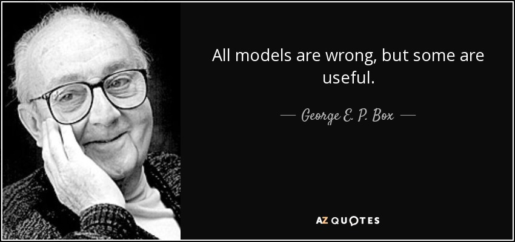
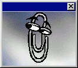
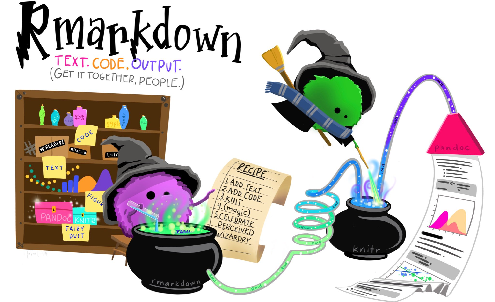

```{r setup, include=FALSE}
knitr::opts_chunk$set(echo = FALSE)
```

## Disclaimer

```
* I am sharing my personal views not the views of RenaissanceRe 
  or any of its subsidiary companies.
  
* Thought provoking only: The materials are provided for information 
  purposes only and are in summary form.
  
* This is not consulting: No representations or warranties are given. 
  If you want to use these ideas, hire a pro.
  
* This is not financial advice: No financial advice is being given 
  nor any recommendation to invest in any product. 
  
* Historical data is no assurance as to future results.
```
```{r, include=FALSE}
library(tidyverse)
library(flextable)
```


## Source

All data, code, and examples: 

[CerebralMastication/Presentations](https://github.com/CerebralMastication/Presentations/)

```{r, out.width = "100%"}
knitr::include_graphics("./fig/github.png")
```

Take Pix, Dance, Ask, Tweet 
**@cmastication**

## 

JD's Lema:

To migrate Excel analysts to R, help them be better at Excel first. 

Then help them use a bit of R for the painful parts. If you fail to migrate them to R you will at least have better Excel!

Fail Safe! 

## @cmastication

<div align="center">

</div>

## {data-background=./fig/rcookbook2e.png}

## Corporations Are Sad Silos {data-background=./fig/Sad_Cubicles_2.png}

## {data-background=./fig/Office-R-github.png}

<sup>Art by Allison Horst</sup>

## {data-background=./fig/tribalism.jpg data-background-size=cover}

## {data-background=./fig/circus_tent_blueprint.png data-background-size=cover}

## {data-background=./fig/avengers_strut.gif }

## {data-background=./fig/fire_deadlift.gif }

## {data-background=./fig/cantdoit.jpg}


## 

JD's Lema:

To migrate Excel analysts to R, help them be better at Excel first. 

Then help them use a bit of R for the painful parts. If you fail to migrate them to R you will at least have better Excel!

Fail Safe! 


## {data-background=./fig/iris_excel.png}

## {data-background=./fig/iris_excel_formula.png}

## {data-background=./fig/iris_excel_pivot.png}

## But that R Environemnt Though...

## Jupyter Lab Loves R

<div align="center">
<embed src="./fig/jupyterlab.gif" width=100% >
</div>
<sup>Shout out to [jupyter-rsession-proxy](https://github.com/jupyterhub/jupyter-rsession-proxy)</sup>

## {data-background=./fig/vicegrips.jpg}

## {data-background=./fig/vicegrip_AC.jpeg}

## {data-background=./fig/vicegrip_dryer.jpeg}

## How To? {.bigcode}

```{r, eval=FALSE, echo=TRUE}
library(tidyverse)
library(openxlsx)
wb <- loadWorkbook("iris_wb.xlsx")
```

## Write & Save {.bigcode}

```{r, eval=FALSE, echo=TRUE}
writeDataTable(
  wb = wb,
  sheet = 'iris_sheet',
  x = iris,
  startCol = 1,
  startRow = 1,
  tableStyle = "TableStyleLight9",
  tableName = 'iris_table')
saveWorkbook(wb = wb,
             file = "iris_wb.xlsx",
             overwrite = T)
```

## https://xkcd.com/1205/ 

<div align="center">

</div>

## 

<br>
<div align="center">

</div>


## (Wrong) Assumptions: {.medium-body}

* All time is of equal value and is interchangeable

* Current frequency of reporting = future freq

* All time spent doing analytics is of equal utility 
   * Are all tasks equal?

* Automated and manual workflows produce the same product 
   * errors?
   

## {.medium-body}

It looks like you're doing a data science!
<div align="center">

</div>
Would you like me to format your integers as dates?!?


## Art by Allison Horst: `@allison_horst`

<div align="center">

</div>
All drawn digitally with Procreate on iPad...

## Art by Allison Horst @allison_horst 

<div align="center">

</div>

